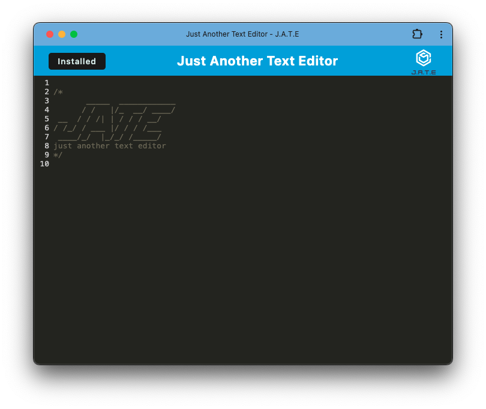

# pwa-text-editor

## Description

This project is a text editor that can run in the browser and is also a PWA (Progressive Web Application).  The application can be installed locally and can work offline.   The IndexDB is used to make data persistent if app is closed and opened again, and uses local storage as a backup.

Building this project gave insight into working with service workers, manifest.json, module builders, and IndexedDB.

## Installation

There are two installation methods to install and use this application.

1.  [Installation via Render](#installation-via-render)
2.  [Installation via local server](#installation-via-local-server)

### Installation via Render

1.  Navigate to the following link in a web browser: https://pwa-text-editor-68fi.onrender.com/
2.  Select the "Install!" button
3.  Follow the prompts to install JATE

### Installation via local server

1.  Download the files from this repository to your local machine
2.  From the root directory of the application, run "npm run install"
3.  From the same directory, run "npm run start"
4.  Open a browser and navigate to http://localhost:3000
5.  Select the "Install!" button
6.  Follow the prompts to install JATE

## Usage

Once the application is launched, simply type into the editor to use it.  Text will automatically be saved and repopulated if the app is restarted.

Here is a screenshot of the application post installation.

## Credits

The starter code for this application is from this repository: https://github.com/coding-boot-camp/cautious-meme

The starter code is missing configurations for the module bundler.  It does not have service workers and cannot be installed as a PWA.

## License

N/A